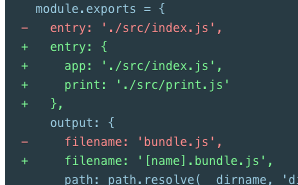
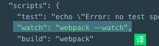

### 背景
先搭建项目框架然后再配置webpack
Webpack常用配置详解

### 调整 package.json 文件
我们需要调整 package.json 文件，以便确保我们安装包是私有的(private)，并且移除 main 入口。这可以防止意外发布你的代码。
```javascript
+   "private": true,
-   "main": "index.js",
    "scripts": {
        ...
    }
```

### 用webpack管理要引入的扩展
使用这种方式去管理 JavaScript 项目会有一些问题：
* 无法立即体现，脚本的执行依赖于外部扩展库(external library)。
* 如果依赖不存在，或者引入顺序错误，应用程序将无法正常运行。
* 如果依赖被引入但是并没有使用，浏览器将被迫下载无用代码。

让我们使用 webpack 来管理这些脚本。
比如index.html引入了
```html
<script src="http://libs.baidu.com/jquery/2.0.0/jquery.min.js"></script>
```
script标签之间存在隐式依赖关系，之所以说是隐式的是因为 index.js 并未显式声明需要引入 lodash。

### 添加npm脚本
> 在package.json加入一个npm 脚本方便打包

```javascript
+     "build": "webpack"
```

### output
随着应用程序增长，开始对文件名使用哈希(hash)]并输出多个 ``bundle``
所以这里通过更新 ``dist/index.html`` 文件，来为 webpack 分离入口做好准备
修改 output，以便根据入口起点名称动态生成 bundle 名称。


更改了我们的一个入口起点的名称，甚至添加了一个新的名称，会发生什么？

生成的包将被重命名在一个构建中，但是我们的index.html文件仍然会引用旧的名字。
我们用 ``HtmlWebpackPlugin`` 来解决这个问题。

### HtmlWebpackPlugin 
如果你在代码编辑器中将 index.html 打开，你就会看到 ``HtmlWebpackPlugin`` 创建了一个全新的文件，所有的 ``bundle`` 会自动添加到 html 中。

你可能会感兴趣，webpack及其插件似乎“知道”应该哪些文件生成。答案是，通过 manifest，webpack 能够对「你的模块映射到输出 bundle 的过程」保持追踪。

### 清理dist文件
假如修改了文件a的命名为a1,此时打包将会生成一个新的文件，所以每次都要清理dist文件。
```javascript
npm install clean-webpack-plugin --save-dev
```

### source map 
当 webpack 打包源代码时，可能会``很难追踪到错误和警告在源代码中的原始位置``。例如，如果将三个源文件（a.js, b.js 和 c.js）打包到一个 bundle（bundle.js）中，而其中一个源文件包含一个错误，那么堆栈跟踪就会简单地指向到 bundle.js。这并通常没有太多帮助，因为你可能需要准确地知道错误来自于哪个源文件。
[source-map](https://webpack.docschina.org/guides/development/#%E4%BD%BF%E7%94%A8-source-map)

### 实时编译 
> 不用每次改动完都手动运行命令行
#### 1.观察者模式

配置完就可以看到webpack是如何编译的

唯一的缺点是，为了看到修改后的实际效果，你需要刷新浏览器。如果能够自动刷新浏览器就更好了，继续往下看。
#### 2.自动刷新浏览器
可以尝试使用``webpack-dev-server``，恰好可以实现我们想要的功能。

原理:
``webpack-dev-server`` 为你提供了一个简单的 ``web 服务器``(划重点），并且能够实时重新加载(live reloading)

> 添加一个 script 脚本，可以直接运行开发服务器(dev server)

### 使用 webpack-dev-middleware 
``webpack-dev-middleware`` 是一个容器(wrapper)，它可以把 webpack 处理后的文件传递给一个服务器(server)。 webpack-dev-server 在内部使用了它，同时，它也可以作为一个单独的包来使用，以便进行更多自定义设置来实现更多的需求。接下来是一个 webpack-dev-middleware 配合 express server 的示例。

接下来我们需要对 webpack 的配置文件做一些调整，以确保中间件(middleware)功能能够正确启用：

### 模块热替换
[热替换](https://webpack.docschina.org/guides/hot-module-replacement/#hmr-%E4%BF%AE%E6%94%B9%E6%A0%B7%E5%BC%8F%E8%A1%A8)

### tree shaking 移除没有用过的代码 
场景：export了某个组件 但是没有页面import
此时就可以使用这种方式移除


