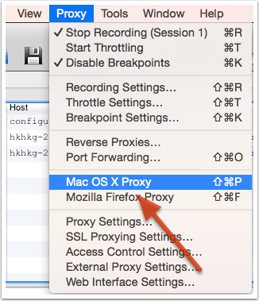

## 前言
本文主要为普及charles原理和用处，具体使用移步
<a href="https://blog.devtang.com/2015/11/14/charles-introduction/">传送门</a>
或官网。

## 原理：
Charles 通过将自己设置成系统的网络访问代理服务器，使得所有的网络访问请求都通过它来完成，从而实现了网络封包的截取和分析。

## 主要的功能包括：

1. 截取 Http 和 Https 网络封包。
2. 支持重发网络请求，方便后端调试。
3. 支持修改网络请求参数。
4. 支持网络请求的截获并动态修改。
5. 支持模拟慢速网络。

## Charles 4 新增的主要功能包括：

1. 支持 Http 2。
2. 支持 IPv6

## 使用场景
### 将charles设置成系统代理
> 之前提到，Charles 是通过将自己设置成代理服务器来完成封包截取的，所以使用 Charles 的第一步是将其设置成系统的代理服务器。

后在需要将 Charles 设置成系统代理时，选择菜单中的 “Proxy” -> “Mac OS X Proxy” 来将 Charles 设置成系统代理。

需要注意的是，Chrome 和 Firefox 浏览器默认并不使用系统的代理服务器设置，而 Charles 是通过将自己设置成代理服务器来完成封包截取的，所以在默认情况下无法截取 Chrome 和 Firefox 浏览器的网络通讯内容。如果你需要截取的话，在 Chrome 中设置成使用系统的代理服务器设置即可，或者直接将代理服务器设置成 127.0.0.1:8888 也可达到相同效果。
### 过滤网络请求

### 截取iphone的网络封包（常用）
原理：将我们移动端上所有请求发送到PC端Charles代理中，Charles会自动抓取http网络包分析请求和返回值。

### 截取https协议信息
需要另外在mac上安装证书！才可以截取该 Host 的所有 SSL 请求

### 模拟慢速网络
在做移动开发的时候，我们常常需要模拟慢速网络或者高延迟的网络，以测试在移动网络下，应用的表现是否正常。Charles 对此需求提供了很好的支持。

### 修改网络请求（常用）
有些时候为了调试服务器的接口，我们需要反复尝试不同参数的网络请求。Charles 可以方便地提供网络请求的修改和重发功能（感觉用postman更快捷）。
我们可以修改该请求的任何信息，包括 URL 地址、端口、参数等。

### 压力测试 略
### 修改服务器返回内容（常用）
本地映射/Map Local Settings：把需要请求网络的文件映射为请求本地文件（常用）
远程映射/Map Remote Settings：把你要请求的地址，映射到一个远程地址；相当于把你的请求地址修改了。

### 设置外部代理，解决与翻墙软件的冲突