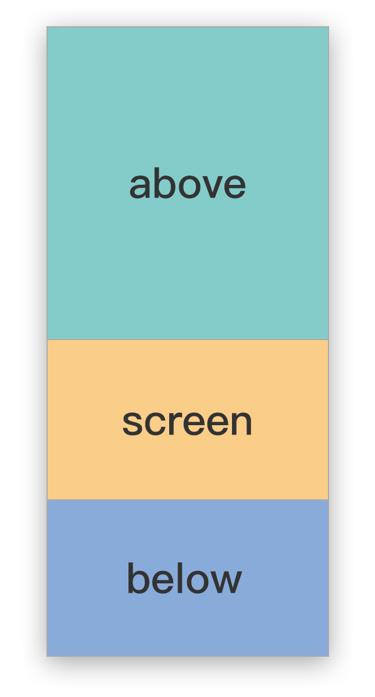
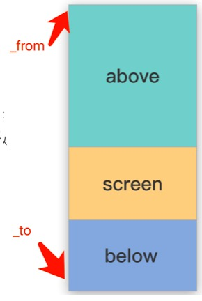
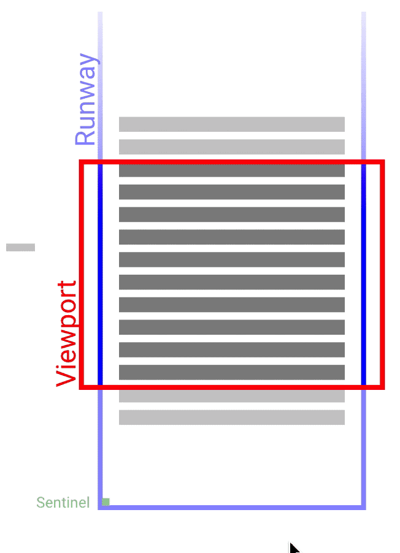

### 前言
源于之前去面试的时候问过下拉加载更多数据时，如果数据超过一千万条还是像平时一样继续插入DOM吗，好吧问懵逼了特此研究了长列表优化~

预览下最终效果
<video src="demo录屏.mov" controls="controls" style="max-width: 100%; display: block; margin-left: auto; margin-right: auto;">
your browser does not support the video tag
</video>

性能优化最常见的点就是减少DOM，长列表引起卡顿问题最核心也是插入过多的DOM

那么现在有几个问题要解决的：

- 什么时候要重新渲染数据列表
- 要渲染哪些数据列表

### 布局
> 先看下整体布局



上图三个色块的作用分别是
- above: 当前显示列表的上方，一般高度为screen高度的2倍
- screen: 我们可以理解为当前屏幕，我们主要是需要通过它来计算出当前screen里可以显示多少个item
- below: 当前屏幕下方

默认情况下，它们所占的比例为2:1:1，那么这里要区分这3个区域，主要是为了列表在滚动的时候能够确保列表中有内容显示。

```javascript
_screen高度： 
const winHeight = $(‘.list’).height();
const itemHeight = $(‘.item’).height();

窗口可视行数：
_rowsInScreen = Math.ceil( winHeight  / itemHeight）

_above = _rowsInScreen * 2 
_below = _rowsInScreen
_max = _rowsInScreen * itemHeight
```
弊端:item要统一高度才可以进行计算。


### 实现
#### Step 1 布局问题
> 保持滚动过程中总高度不变（制作假高度）

先把列表的元素结构改一下
```html
< div class="content">
  < ul class="list">
    < li class="item">< /li>
  < /ul>
< /div>
```

然后有很多方法呀 例如：
1: 对ul设置总高度，然后显示item进行相对定位
2: 在列表的开始和结尾各放一个元素来撑开高度
3: 和方法1差不多，使用padding或者margin来撑开顶部高度 （本列子使用的方法）
即每次重新插入数据列表的时候也会给$('.list')重置paddingTop，制造一个假高度。
计算如下

```javascript
const scrollHeight = $('.list').scrollTop()
$('.list').css('paddingTop',scrollHeight - scrollHeight % 30) 
```

#### Step 2 开始处理数据
> 先给两个缓存数据对象

```javascript
const list = [ ]  // 用来存储接口返回的所有数据
const prewviewList = [ ]  // 用来存储要插入dom的数据
```

#### Step 4 什么时候重组数据列表
```javascript
if (lastScrollTop === null || Math.abs(scrollTop - lastScrollTop) > _max) {
    lastScrollTop = scrollTop;
    //重组数据列表
} else {
    return;
}
```
这里主要是判断当screen（可视区域）的scrollTop减去上一次的ScrollTop会大于最大高度_max（_max = screen的items数 * item高度 即屏幕可视窗口）的时候,就会开始重组列表数据。

#### Step 5 数据列表要插入的数据

```javascript
_from = parseInt(_scrollTop / itemHeight) - _above;
if (_from < 0) {
    _from = 0;
}

_to = _from + _above +_below +_rowsInWindow;
if (_to > list.length) {
    _to = list.length;
}
```

计算出了窗口可视元素_from 到 _to元素之后就可以获取新的数据列表prewList,看下一步 ->


#### Step 6 把新的数据列表渲染到Dom
```javascript
for (; _from < _to; _from++) {
    previewList.push(list[_from])
    
    //方案一  拿到新的数据列表再渲染到指定的dom里去
    $(‘.list’).html(…)
    
    //方案二  还可以用Dom回收的方式
}
```
##### 简单看下Dom回收的原理


#### Step 7 图片处理
> 阙值范围内的图片路径赋值，这里还有其他方法可以优化，有业务场景使用到时再回来补全。。

```javascript
const prewviewList = [{
	content: ‘something...',
	img: 'http://imageurl......'
},	{
	content: 'ok...',
	img: ‘http://imageurl......'
},…]
```

### 检测优化结果
> 性能测试的几种手短

1）使用window.performance
2）使用console.time方法与console.timeEnd方法（本例使用）
3）使用专业的测量工具／平台：jsPerf

背景：接口返回一万条简单数据。
优化前渲染耗时：2s → 优化后渲染耗时：2ms
当返回大量的数据收益会翻倍

### 总结

1.计算出什么时候要重组数据列表
2.重组哪部分数据
3.处理图片


### 题外话
关于UX的用户体验：可以多一点淡入效果
简书和知乎用的方法和本例有点相似，但是每次加载的数据会放在一个标签例如
```html
<div class="contain">第一次加载的数据</div>
<div class="contain">第二次加载的数据</div>
...
```
### 参考资料
> [百度团队长列表优化方案](https://exp-team.github.io/blog/2017/02/25/js/infinite-scroll/)
> [Vue长列表优化](https://juejin.im/entry/5819993fbf22ec0068aab054)
> [阿里刘欣然 长列表性能优化](https://pan.baidu.com/s/1o8QZEzg#list/path=%2F)


