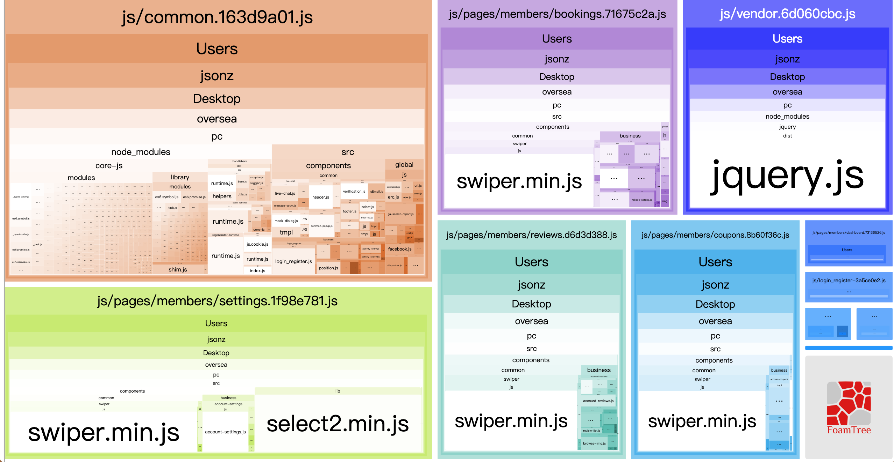
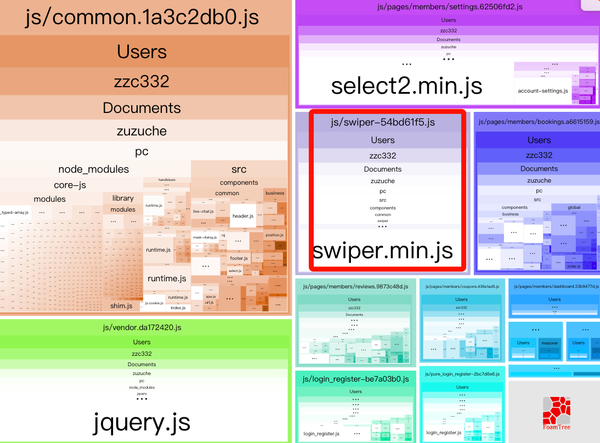

## 前言
先看下当前的打包结果：

由上图可以看到每个组件重复打包了一个swiper.min.js文件
是否可以抽取其中每个页面的swiper.min.js(滑动组件) 成单独一个文件？

可以跳至文末看最终优化结果。

## step1 项目打包情况
这里只列举了一个组件（包含多个页面组件），实际整个项目打包结果webpack统计图会更复杂。
> 配置webpack插件 `webpack-bundle-analyzer` 
官网：https://www.npmjs.com/package/webpack-bundle-analyzer

首先本地下载下载插件
```javascript
$ npm intall webpack-bundle-analyzer --save-dev
```

其次在项目中配置（make-webpack.config.js文件)
```javascript
const BundleAnalyzerPlugin = require('webpack-bundle-analyzer').BundleAnalyzerPlugin;
 
module.exports = {
  plugins: [
    new BundleAnalyzerPlugin()
  ]
}
```
在package.json中添加命令
```javascript
“script”: {
    "analyz": "NODE_ENV=production npm_config_report=true npm run deploy:prod"
}
```

然后命令行输入
```javascript
npm run analyz
```
就会看到一开始bundle的统计图啦

## step2 webpack优化
step1列出了项目中较大的包，剩下的事情就是想办法如何减小这些包的体积（将一个大包拆成多个小包）。
项目中产生较大的包的原因可以从两个方面去考虑：
   - 1.项目中引入的依赖包过于庞大；
   - 2.业务代码集中在一块写，或者是业务代码写的比较繁琐；

对于这两个问题，我们可以从两个方面着手解决：
    - 1.抽离项目中公共依赖的、不常变动的、体积较大的包；
    - 2.将一个较大的业务代码文件，拆成多个较小的文件，异步加载（或者优化业务代码）。<-我用的方案
  
思路：
将swiper.js改成异步加载
 

```javascript
// 原本代码:
module.exports = require('../swiper');

// 修改成异步加载的方式导出：
export default import(
  '../swiper'
);
```

导入swiper组件
```javascript
import getSwiper from 'components/common/swiper'; 

// import().then();
getSwiper.then(swiper =>{
    this.counpSwiper = new swiper('.swiper-container', {
    autoHeight: true,
    noSwiping: true,
    noSwipingClass: 'swiper-slide',
});
```

## 优化结果
运行命令
```javascript
npm run analyz
```
看到新的统计图

swiper单独打包成一个文件~
素不素很神奇~~END